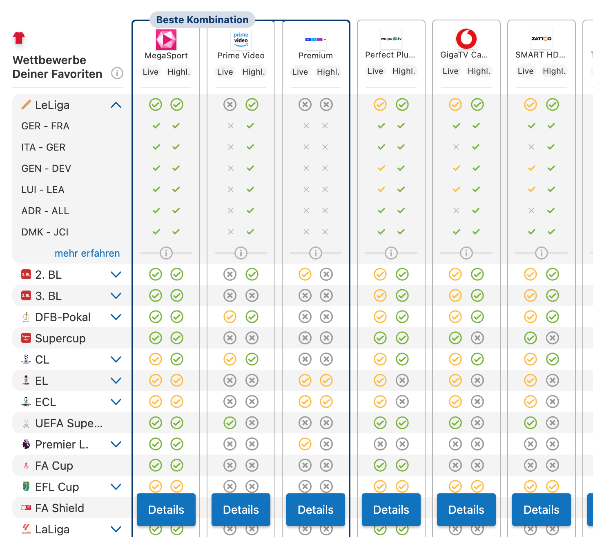
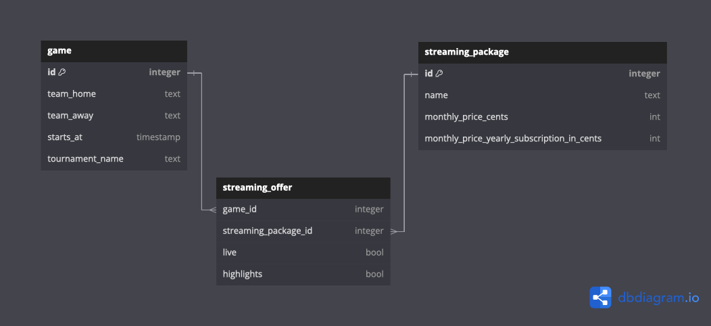

# CHECK24 GenDev Best Combination Challenge

**Note:**
This is the challenge for the **6th round** of the [GenDev Scholarship](https://check24.de/gen-dev).
We're looking forward to your application - happy coding. 🤓

Finding the best streaming packages from Magenta Sports, Amazon Prime, or Sky to watch your favorite football team can be tricky with their extensive offerings. It's also an interesting problem to tackle if you want to get the best combination that fits all of Bayern Munichs matches during the Bundesliga and Champions League. Now it's your turn to build it!

## Table of Contents
- [The Challenge 🤔](#the-challenge)
- [Minimum Requirements ✅](#minimum-requirements)
- [Example 🖥️](#example)
- [UI 💅](#ui)
- [Data Processing 🧑🏼‍💻](#data-processing)
- [Dataset ⚽️](#dataset)
- [How Can I Hand In My Project? 🚀](#how-can-i-hand-in-my-project)
- [Questions? ❓](#questions)

## The Challenge
Build an application that allows users to compare the best streaming packages for watching their favorite teams' matches. Users can select one or more teams and receive a comparison of streaming packages based on the availability of the selected teams' games. If one package doesn't stream every match, the next step is to compute the best combination of packages. The combination of packages should cover as many games as possible while finding the lowest total price. Additionally, you can decide when it makes sense to add a package to another combination, taking into account the number of packages, price increase per additionally featured game or other metrics. The focus should be on comparing the most packages / finding the best combination in the given time.

### Minimum Requirements
1. Team selection for one or multiple teams
2. Ranking of streaming packages based on availability of streamed matches
3. Offering the smallest price combination you can find if one package doesn't cover everything
4. Reasonable search time - under 500ms

There's always room for an improved feature set. Maybe it can make sense to book monthly packages one after another expires, instead of purchasing multiple yearly ones together. Improve, adapt, overcome.

More inspiration:

1. Search by teams, leagues, date ranges and more
2. Save past searches and recommend similar packages
3. Visualize the upcoming games and the availability on streaming services

### Example
A user wants to watch matches of their favorite teams and compares the best streaming packages for them. The result can look similar to this:

---

Some interesting queries, that we'll test:
- Bayern München (of course)
- Hatayspor, Deutschland, Bayern München and Real Madrid
- Minimum number of services for *all* games
- Oxford United, Los Angeles FC, AS Rom

### UI
The challenge shouldn't just be a simple CLI script but also implement a working user interface. It doesn't have to be fancy, but should be easy to use. We are open for a variety of different technologies, so feel free to create an iOS, Android, Leptos, Web or Desktop application. 

### Data Processing
Performance is as always very important. The maximum duration has to be less than 500ms, find the best combination possible in this time. Use whatever tech stack you prefer and feel free to implement your own algorithms, data structure, caching or pre-computation.

## Dataset
You can request the dataset [here](https://github.com/check24-scholarships/check24-best-combination-challenge-datasets). Included are three CSV files, which are the basis for your project. It's mostly real world data.

**Games**
Games are played by two teams on a given date in a tournament.

**Streaming Packages**
These packages are offered by companies like Magenta, Sky, etc. and have a monthly/yearly price. Your objective is to list these in your result overview.

**Streaming Offers**
An offer is from a streaming package for a specific game. It specifies the availability for live viewing or on demand highlights. Both availabilities should be included in the result comparison.

## How Can I Hand In My Project?

Create a private GitHub repository and commit your code there. Provide READ permissions to [gendev@check24.de](mailto:gendev@check24.de) then, so that we can see what you have been building. When you hand in your application for the scholarship on our scholarship website, include the link to your GitHub repository.

What should be included:

- Your working code
- A toplevel README.md that explains your approach (including possible optimizations)
- We want to see your project in action. To achieve that there are two options:
    - Make your project runnable for everybody (e.g. by having a `docker-compose.yaml`). If this is possible for your project please add a section "How to run locally" to your project's README.md.
    - Run your project in your own environment and demonstrate it by using screen recording (there are plenty of tools that can support you with that). Upload that video somewhere (e.g. YouTube or some other cloud and include a link to it in your README.md). 
    - If it's a Web App you can also host it anywhere and provide the link in the README.md. Don't spend too much time on the hosting, your code is the focus.

So, what else? Have fun! We're looking forward hearing from you! 😎

[Click here to start the challenge and access the datasets 🚀](https://check24-6th-gendev.vpetritz.net/)

### Questions?
In case of any questions, contact [gendev@check24.de](mailto:gendev@check24.de).